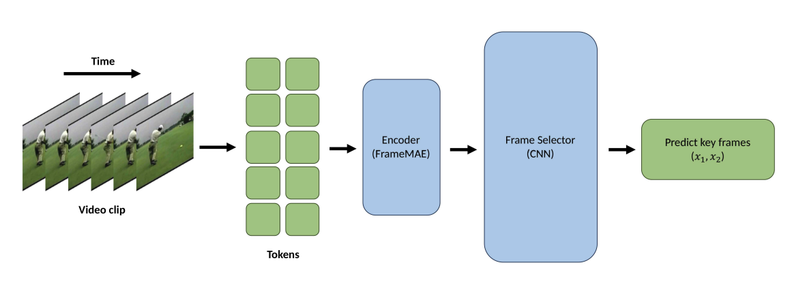

# FrameRS

#### Qiqian Fu, Guanhong Wang, Gaoang Wang
Our FrameRS model is consists of FrameMAE and Key Frame Selector. It can
extract the key frames out of a video and use the extracted frames for 
video reconstruction. The Frame Reconstructor is called FrameMAE, which 
stands for Frame Video Masked Autoencoder, make use of the Compared with 
traditional Key Frame Extract algorithm, our model has two main advantages: 1) it 
requires low computation cost. 2) it performances are well. The structure is shown below.

The Key Frame Selector
takes the intermediate layer of the FrameMAE as its input. The intermediate layer 
possesses high-dimensional semantic information, which can enhance the accuracy of 
Key Frame Selector and simplify the network model, thereby reducing computational costs.
The FrameMAE, together 
with our customized Key Frame Selector, we can compress a video clip by only storing around 
30% of the original key frames of the video clip for reconstruction. The structure of key frame selector is shown below.

## 🔨 Data Preparation

#### Follow the instructions in [DATASET.md](DATASET.md) for data preparation.

## ➡️ Pretrainng

#### Follow the instruction in [readme.md]() for training FrameMAE and Key Frame Selector

## 👍 Acknowledgements 

#### Our project is based on [VideoMAE](https://github.com/MCG-NJU/VideoMAE) for its structure design.
